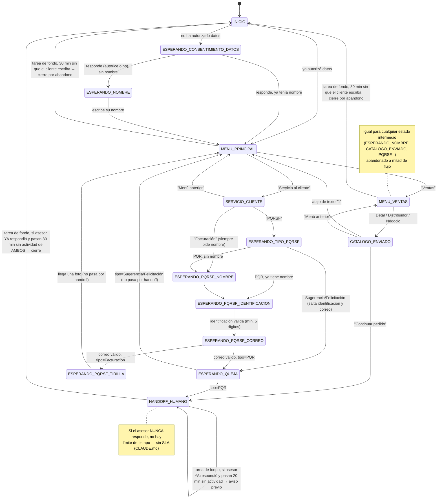

# Flujo de estados del bot

Motor de estados determinista. Sin IA. Es una función pura:

```
procesarTransicion(entrada: EntradaMotor) → ResultadoTransicion
```

`EntradaMotor` trae `estadoActual`, `mensajeTexto`, `esImagen`, `contexto`, `clienteYaTieneNombre`,
`nombreCliente`, `huboInactividad`, `aceptoTratamientoDatos` y `esSeleccionInteractiva` (true si
`mensajeTexto` es el id de un botón/lista tocado, no texto libre real — ver "Botones tocados fuera
de contexto" más abajo).
`ResultadoTransicion` trae `nuevoEstado`, `respuestas` (plural — un turno puede generar más de un
mensaje), `contextoParcheado` y `registro` (qué debe persistir el caso de uso: un pedido, un
registro de servicio al cliente, o nada — ya no implica necesariamente que la conversación llegó a
`HANDOFF_HUMANO`, ver Facturación más abajo). **La firma completa y autoritativa vive en
`docs/CONTRATOS.md`** — este documento describe el comportamiento de cada transición, no repite la
firma en detalle.

## Regla de reinicio por inactividad

Antes de invocar el motor, el caso de uso (`application/procesarMensajeEntrante.ts`) calcula
`huboInactividad = (ahora - conversacion.actualizada_en) > ventana`, donde la ventana es
configurable vía `VENTANA_INACTIVIDAD_HORAS` (env, default `0.5` = 30 minutos — ver
`docs/VARIABLES_ENTORNO.md`). Este mismo número también es el umbral base del aviso de "mucha
demanda" (ver más abajo) — decisión del cliente: un solo número para ambos conceptos.

- Si `huboInactividad === true` y `estadoActual !== 'INICIO'` → el motor ignora el estado guardado
  y trata el mensaje como si viniera de `INICIO` (`desdeInicio`, saludo genérico o personalizado
  según si el cliente ya tiene nombre **y** ya autorizó el tratamiento de datos).
- **Excepción: `HANDOFF_HUMANO` queda exento de esta regla** (`motorEstados.ts`) — aunque
  `huboInactividad` sea `true`, un mensaje del cliente en ese estado sigue yendo a `desdeHandoff`
  (el aviso de "mucha demanda"), nunca reinicia con un saludo nuevo. Motivo: el bot no puede saber
  solo con el tiempo transcurrido si el asesor sigue trabajando el caso, así que el único camino de
  salida de `HANDOFF_HUMANO` es el cierre explícito de `tareaCierreHandoff.ts` (ver más abajo), que
  sí considera la actividad del asesor (vía `registrarRespuestaAsesor.ts`).
- Esto reemplaza cualquier mecanismo de cron para el reinicio del flujo: se resuelve de forma
  perezosa en cada mensaje entrante, así que sobrevive reinicios del servidor sin estado adicional.
- El motor en sí no consulta la hora ni la BD — recibe `huboInactividad` ya calculado como
  parámetro (se mantiene puro).
- 30 minutos es corto frente a la ventana real de mensajería libre de WhatsApp (24h) — es una
  decisión de producto del cliente, no una limitación técnica. Cualquiera de las dos variables se
  puede ajustar libremente en `.env`.

## Botones tocados fuera de contexto

Los botones de WhatsApp no caducan visualmente: un mensaje con botones enviado hace rato sigue
siendo tocable en el chat del cliente, aunque la conversación ya haya avanzado a un estado
totalmente distinto (ej. tocar "Menú anterior" de `SERVICIO_CLIENTE` mientras el bot espera el
nombre del cliente). `mapearPayloadYCloud` (ver `docs/INTEGRACION_YCLOUD.md`) marca
`esSeleccionInteractiva: true` cuando el mensaje viene de un botón/lista en vez de texto libre
real — las transiciones que capturan datos (`ESPERANDO_NOMBRE`, `ESPERANDO_PQRSF_NOMBRE`,
`ESPERANDO_PQRSF_IDENTIFICACION`, `ESPERANDO_PQRSF_CORREO`, `ESPERANDO_QUEJA`) revisan esa marca y
rechazan el mensaje (piden el dato de nuevo, sin avanzar de estado) en vez de guardar el id del
botón tal cual como si el cliente lo hubiera escrito. Bug real detectado en producción
2026-08-13 — antes de este fix, `clientes.nombre` podía terminar con el id de un botón viejo.

## Diagrama de estados



`HANDOFF_HUMANO` es terminal en el sentido de que el flujo normal no sigue avanzando — pero no es
silencio total: cada mensaje del cliente recibe de vuelta el aviso de "mucha demanda" hasta que el
asesor responde (ver más abajo). A diferencia del resto de estados, no se reinicia por inactividad
cuando el cliente vuelve a escribir — el único camino de salida es el cierre explícito de la tarea
de fondo, y solo empieza a contar una vez que el asesor respondió al menos una vez. Cualquier otro
estado intermedio (ni INICIO ni HANDOFF_HUMANO) que el cliente abandone también se cierra
proactivamente por la misma tarea de fondo, sin esa condición del asesor.

## Tabla de transiciones

| Estado origen | Condición del input | Estado destino | Respuesta del bot | Efecto en contexto/BD |
|---|---|---|---|---|
| `INICIO` | mensaje no-texto | `INICIO` (mismo) | "Por ahora solo puedo leer mensajes de texto..." | — |
| `INICIO` | cliente nuevo (sin consentimiento) | `ESPERANDO_CONSENTIMIENTO_DATOS` | Saludo genérico + mensaje de consentimiento (Ley 1581 de 2012), botones "Autorizo" / "No autorizo" | — |
| `INICIO` | cliente ya autorizó y ya tiene nombre | `MENU_PRINCIPAL` | Saludo personalizado "¡Hola de nuevo, {nombre}!..." + botones "Servicio al cliente" / "Ventas" | — |
| `ESPERANDO_CONSENTIMIENTO_DATOS` | opción no reconocida | mismo estado | "No entendí esa opción..." + reenvía botones | — |
| `ESPERANDO_CONSENTIMIENTO_DATOS` | "Autorizo" o "No autorizo", cliente sin nombre | `ESPERANDO_NOMBRE` | "Para darte una atención más personalizada, ¿cuál es tu nombre?" | `contexto.aceptoTratamientoDatos` = true/false; se persiste en `clientes.acepto_tratamiento_datos` |
| `ESPERANDO_CONSENTIMIENTO_DATOS` | ídem, cliente ya tenía nombre | `MENU_PRINCIPAL` | "¿{nombre}, en qué te podemos ayudar?" + botones | ídem |
| `ESPERANDO_NOMBRE` | texto libre (se usa tal cual) | `MENU_PRINCIPAL` | "¿{nombre}, en qué te podemos ayudar?" + botones | Guardar `nombre` en `clientes` |
| `MENU_PRINCIPAL` | opción no reconocida | mismo estado | "No entendí esa opción..." + reenvía botones | — |
| `MENU_PRINCIPAL` | "Servicio al cliente" | `SERVICIO_CLIENTE` | "¿En qué te podemos ayudar?" + botones "Facturación" / "PQRSF" / "Menú anterior" | — |
| `MENU_PRINCIPAL` | "Ventas" | `MENU_VENTAS` | "¿Buscas comprar al detal, eres distribuidor o tienes un negocio?" + botones "Detal" / "Distribuidor" / "Negocio" | — |
| `SERVICIO_CLIENTE` | opción no reconocida | mismo estado | "No entendí esa opción..." + reenvía botones | — |
| `SERVICIO_CLIENTE` | "Menú anterior" | `MENU_PRINCIPAL` | "¡Claro(, {nombre})! ¿En qué más te podemos ayudar?" + botones | — |
| `SERVICIO_CLIENTE` | "Facturación" | `ESPERANDO_PQRSF_NOMBRE` | "Para el área de facturación necesitamos confirmar nuevamente algunos datos, ¿cuál es tu nombre completo?" — **siempre**, aunque el cliente ya tenga nombre guardado | `contexto.pqrsfTipo = 'Facturacion'` |
| `SERVICIO_CLIENTE` | "PQRSF" | `ESPERANDO_TIPO_PQRSF` | "Con gusto te ayudamos con tu PQRSF..." + botones "PQR" / "Sugerencia/Felicit" (título truncado por el límite de 20 caracteres de los Reply Buttons; el significado completo va en el cuerpo del mensaje) | — |
| `ESPERANDO_TIPO_PQRSF` | opción no reconocida | mismo estado | "No entendí esa opción..." + reenvía botones | — |
| `ESPERANDO_TIPO_PQRSF` | "PQR", cliente sin nombre | `ESPERANDO_PQRSF_NOMBRE` | "¿Cuál es tu nombre completo?" | `contexto.pqrsfTipo = 'PQR'` |
| `ESPERANDO_TIPO_PQRSF` | "PQR", cliente ya tiene nombre | `ESPERANDO_PQRSF_IDENTIFICACION` | "Gracias, {nombre}. Antes de continuar: verifica que los datos que nos compartas sean correctos, ya que se usarán para tu trámite. ¿Me compartes tu número de identificación (cédula o NIT)?" | `contexto.pqrsfTipo = 'PQR'` |
| `ESPERANDO_TIPO_PQRSF` | "Sugerencia/Felicit" | `ESPERANDO_QUEJA` | "¡Con gusto! 🙌 Cuéntanos tu sugerencia o felicitación con toda confianza." — **salta identificación y correo por completo**, no hace falta que un asesor le dé seguimiento | `contexto.pqrsfTipo = 'Sugerencia'` |
| `ESPERANDO_PQRSF_NOMBRE` | texto libre | `ESPERANDO_PQRSF_IDENTIFICACION` | "Gracias, {nombre}. Antes de continuar: verifica que los datos que nos compartas sean correctos, ya que se usarán para tu trámite. ¿Me compartes tu número de identificación (cédula o NIT)?" | Guardar `nombre` en `clientes` (solo si aún no lo tenía) |
| `ESPERANDO_PQRSF_IDENTIFICACION` | texto con al menos 5 dígitos (se extraen solo los dígitos, ignorando prefijos como "NIT:" o puntos/guiones — ej. "nit: 900.123.456-7" se guarda como "9001234567") | `ESPERANDO_PQRSF_CORREO` | "Perfecto. ¿A qué correo electrónico podemos escribirte para dar respuesta?" | Guardar el número (ya normalizado) en `clientes.identificacion` |
| `ESPERANDO_PQRSF_IDENTIFICACION` | menos de 5 dígitos (o ninguno) | mismo estado | "Ese número de identificación no parece válido 🤔 ¿me compartes solo los números de tu cédula o NIT?" | — (no se persiste nada) |
| `ESPERANDO_PQRSF_CORREO` | estructura de correo inválida (no matchea `/^[^\s@]+@[^\s@]+\.[^\s@]+$/` — solo se valida forma, no el dominio, para tolerar correos corporativos/personalizados) | mismo estado | "Ese correo no parece válido 🤔 ¿me lo compartes de nuevo? (ej: nombre@correo.com)" | — (no se persiste nada) |
| `ESPERANDO_PQRSF_CORREO` | correo válido, tipo=Facturación | `ESPERANDO_PQRSF_TIRILLA` | "Para tramitar tu factura electrónica, compártenos una foto de la tirilla o recibo de tu compra 🧾" | Guardar `correo` en `clientes` |
| `ESPERANDO_PQRSF_CORREO` | correo válido, tipo=PQR | `ESPERANDO_QUEJA` | "Ya casi terminamos... Cuéntanos con detalle qué sucedió" | Guardar `correo` en `clientes` |
| `ESPERANDO_PQRSF_TIRILLA` | mensaje que no es una imagen (texto, audio, sticker, video, o nada) | mismo estado | "Necesito que sea una foto de la tirilla o recibo, por favor. 📷" | — |
| `ESPERANDO_PQRSF_TIRILLA` | llega una imagen | `MENU_PRINCIPAL` | Cierre de facturación (ver abajo) — **no pasa por `HANDOFF_HUMANO`**, no hace falta que un asesor tome la conversación | Crear registro en `servicio_cliente` (`tipo='Facturacion'`, descripción fija "Solicitud de facturación"). El bot no guarda la imagen en ningún lado — el equipo ya la ve en el mismo chat de WhatsApp (coexistencia) |
| `ESPERANDO_QUEJA` | texto libre, tipo=PQR (descripción, se guarda tal cual) | `HANDOFF_HUMANO` | Cierre + tarjeta resumen (tipo, nombre, identificación, correo, descripción) | Crear registro en `servicio_cliente` (`tipo='PQR'`, `descripcion`) |
| `ESPERANDO_QUEJA` | texto libre, tipo=Sugerencia/Felicitación | `MENU_PRINCIPAL` | Agradecimiento ("¡Muchas gracias por tu comentario...! Lo tendremos muy en cuenta") + reabre el menú principal — **no promete seguimiento de un asesor ni manda tarjeta resumen**, por eso no pasa por `HANDOFF_HUMANO` | Crear registro en `servicio_cliente` (`tipo='Sugerencia'`, `descripcion`) |
| `MENU_VENTAS` | opción no reconocida | mismo estado | "No entendí esa opción..." + reenvía botones | — |
| `MENU_VENTAS` | "Detal" / "Distribuidor" / "Negocio" (mismo comportamiento en los 3 casos) | `CATALOGO_ENVIADO` | "📖 *Catálogo:*" + documento (catálogo único) + "📌 Antes de comprar, ten en cuenta esta información:" + imagen ("cómo comprar": tiempos de entrega, valor del domicilio, etc.) + "¿Seguimos con tu pedido?..." con botones "Continuar pedido" / "Menú anterior" | `contexto.canal = 'detal'|'distribucion'|'negocio'` |
| `CATALOGO_ENVIADO` | atajo de texto "1" | `MENU_PRINCIPAL` | "¡Claro(, {nombre})! ¿En qué más te podemos ayudar?" + botones | — |
| `CATALOGO_ENVIADO` | opción no reconocida | mismo estado | "No entendí esa opción..." + reenvía botones | — |
| `CATALOGO_ENVIADO` | "Menú anterior" | `MENU_VENTAS` | "¿Buscas comprar al detal, eres distribuidor o tienes un negocio?" | — |
| `CATALOGO_ENVIADO` | "Continuar pedido" | `HANDOFF_HUMANO` | Cierre + tarjeta resumen (cliente, canal) | Crear registro en `pedidos` (`canal`; `producto_interes` queda vacío — el asesor lo pregunta directamente) |
| `HANDOFF_HUMANO` | mensaje del cliente, `contexto.asesorRespondio` ausente | `HANDOFF_HUMANO` | Aviso de "mucha demanda" (ver abajo) | — |
| `HANDOFF_HUMANO` | mensaje del cliente, `contexto.asesorRespondio === true` | `HANDOFF_HUMANO` | Ninguna (silencio) | — |
| cualquier estado excepto `HANDOFF_HUMANO` | `huboInactividad === true` y `estadoActual !== INICIO` | según `INICIO` | Igual que el flujo `INICIO` | Se trata como reinicio de conversación |
| `HANDOFF_HUMANO` | evento `whatsapp.smb.message.echoes` (mensaje del asesor) | `HANDOFF_HUMANO` (sin cambio) | Ninguna — no pasa por el motor | `tocarActividad` + `contexto.asesorRespondio = true` (ver "Detección de la respuesta del asesor") |

## Ya no se pregunta ciudad ni producto de interés

Decisión del cliente: el asesor humano pregunta ciudad y producto directamente al tomar la
conversación, no el bot. Esto simplificó el flujo de Ventas de forma importante frente a versiones
anteriores del proyecto:

- No existe `ESPERANDO_CIUDAD` ni el enum `Ciudad` (`src/dominio/ciudad.ts` se eliminó).
- No existe distinción de catálogo por cobertura ni por canal — un solo PDF (`CATALOGO_URL`) para
  las 3 categorías de Ventas.
- `pedidos.producto_interes` queda siempre vacío (columna conservada solo por compatibilidad con
  registros anteriores a este cambio).
- `clientes.ciudad` y `pedidos.ciudad` siguen existiendo en el schema mismo motivo (compatibilidad
  con datos anteriores), pero ningún flujo nuevo los llena.

## El nombre se pide una sola vez, justo después del consentimiento de datos

A diferencia de versiones anteriores (donde el nombre se pedía solo si el cliente elegía "Ventas",
con un paso extra ofreciendo confirmar el nombre de perfil de WhatsApp), ahora:

- El nombre se pregunta **una sola vez**, inmediatamente después de que el cliente responde el
  consentimiento de datos (autorice o no) — antes de llegar a `MENU_PRINCIPAL`. Ya no se sugiere el
  nombre de perfil de WhatsApp (`customerProfile.name`) — se pregunta directo, sin ese paso
  intermedio (el estado `CONFIRMAR_NOMBRE_PERFIL` ya no existe).
- Por eso `MENU_PRINCIPAL → "Ventas"` va **directo** a `MENU_VENTAS`: para cuando el cliente llega
  ahí, siempre hay un nombre disponible.
- **Excepción**: la rama Facturación de Servicio al cliente vuelve a preguntar el nombre completo
  como confirmación de datos para el proceso de facturación, aunque el cliente ya tenga uno
  guardado (`iniciarCapturaPqrsf.ts`, parámetro `forzarPreguntaNombre`). PQR no lo hace — si el
  cliente ya tiene nombre, lo salta. Sugerencia/Felicitación ni siquiera pasa por
  `iniciarCapturaPqrsf.ts` (ver más abajo).

## Menús: Reply Buttons (decidido — no texto libre, no hay List Message activo)

Para evitar datos sucios en las preguntas de respuesta cerrada, se usan Reply Buttons de WhatsApp
en vez de texto libre:

- **Reply Buttons** (`RespuestaBot` tipo `'botones'`): todos los menús del flujo actual
  (`MENU_PRINCIPAL`, `SERVICIO_CLIENTE`, `ESPERANDO_TIPO_PQRSF`, `MENU_VENTAS`,
  `CATALOGO_ENVIADO`) — todos con **2-3 opciones**, dentro del límite de WhatsApp (máx. 3 botones,
  título de cada uno máx. 20 caracteres).
- **List Message** (`RespuestaBot` tipo `'lista'`): el tipo sigue existiendo en el contrato
  (`src/motor/motorEstados.ts`) por si algún menú futuro necesita más de 3 opciones, pero **hoy no
  lo usa ningún estado activo** (la pregunta de ciudad, que era la única que lo necesitaba, se
  eliminó).

El cliente **siempre puede escribir en vez de tocar el botón** — `buscarOpcionSeleccionada()`
(`src/motor/transiciones/seleccionDeLista.ts`) compara por `id` o `título` sin distinguir
mayúsculas/espacios; si no coincide con ninguna opción, el bot repite el mismo menú con un mensaje
corto de "no entendí" en vez de perderse.

## Mensajes inesperados (audio, imagen, sticker, video)

En cualquier estado que no sea `HANDOFF_HUMANO` ni `ESPERANDO_PQRSF_TIRILLA`: si el mensaje
entrante no es texto, la transición correspondiente devuelve el **mismo estado**
(`nuevoEstado === estadoActual`) con una respuesta genérica pidiendo texto. No se pierde el
progreso de la conversación.

En `HANDOFF_HUMANO`: se ignora igual que cualquier otro mensaje (no cambia si además dispara el
aviso de demanda — ver abajo, esa lógica no depende de si el mensaje es texto).

**`ESPERANDO_PQRSF_TIRILLA` es la excepción inversa**: es el único estado que necesita una imagen
en vez de texto — cualquier otro tipo de mensaje (incluido texto libre) se rechaza con "Necesito
que sea una foto..." y el estado no avanza (ver tabla de transiciones más arriba).

## Tarjetas resumen en el handoff

Cada rama que llega a `HANDOFF_HUMANO` manda, además del mensaje de cierre, una tarjeta con los
datos que ya capturó el bot — para que el asesor no tenga que subir en el chat a buscarlos:

- **Pedido** (Ventas): `📦 Resumen del pedido` — Cliente, Canal.
- **PQR**: `📋 Resumen de tu solicitud` — Tipo, Nombre, Identificación, Correo, Descripción.

**Ni Facturación ni Sugerencia/Felicitación llegan a `HANDOFF_HUMANO`, así que ninguna de las dos
genera tarjeta resumen** — ambas cierran solas, sin que un asesor tenga que tomar la conversación
(ver tabla de transiciones: `ESPERANDO_PQRSF_TIRILLA` para Facturación, `ESPERANDO_QUEJA` con
`tipo=Sugerencia` para Sugerencia/Felicitación). Los datos de Facturación (nombre, identificación,
correo) igual quedan guardados en `clientes` y visibles en el dashboard — la tarjeta en el chat ya
no aporta nada porque nadie del equipo necesita "recogerla" en vivo.

Esto reemplaza al antiguo mensaje `"🔔 NUEVO CLIENTE — ..."` / `"🔔 QUEJA/RECLAMO — ..."` de
versiones anteriores del proyecto — la notificación destacada se descartó a favor de esta tarjeta
más completa, en el mismo hilo del cliente (no hay número o chat separado para el equipo — ver
`clientes.telefono`/`YCLOUD_NUMERO_EQUIPO` en `docs/VARIABLES_ENTORNO.md`, que hoy no se usa en
ninguna notificación).

## Aviso de "mucha demanda" en HANDOFF_HUMANO

Cada mensaje que el CLIENTE escribe mientras la conversación sigue en `HANDOFF_HUMANO` recibe el
mismo aviso de vuelta (`desdeHandoff.ts`), sin importar cuánto tiempo lleve ahí — el reinicio
reactivo por inactividad no aplica a este estado (ver más abajo). Es puramente reactiva — solo se
dispara si el cliente escribe; los mensajes del asesor se manejan aparte (siguiente sección) y
nunca generan este aviso.

**Se apaga en cuanto el asesor responde una vez.** `desdeHandoff.ts` revisa
`contexto.asesorRespondio` (marcado por `registrarRespuestaAsesor.ts`, ver siguiente sección): si
ya es `true`, deja de mandar el aviso en cada mensaje del cliente — no tiene sentido seguir
avisando "en breve te atendemos" si el asesor ya está ahí hablando directamente. La conversación
queda en silencio total (el bot no vuelve a intervenir) hasta que `tareaCierreHandoff.ts` la
cierre.

Texto del aviso (`src/motor/transiciones/mensajeAvisoDemanda.ts`):

```
Gracias por tu paciencia. 🐮💚❤️

En este momento estamos atendiendo una alta demanda de solicitudes. Nuestro equipo estará
contigo en breve para brindarte la atención que necesitas.

✨ Agradecemos mucho tu comprensión y esperamos atenderte muy pronto.
```

## Detección de la respuesta del asesor (whatsapp.smb.message.echoes)

Confirmado contra un payload real (2026-08-13): cuando el equipo responde un chat desde la app
nativa de WhatsApp (coexistencia), YCloud sí manda un evento al webhook —
`whatsapp.smb.message.echoes`, con el teléfono del cliente en `whatsappMessage.to` (hay que
habilitar este tipo de evento en el panel de YCloud; no viene activo por defecto). Antes de esto se
asumía que el bot no podía saber si el asesor había respondido — ya no es el caso.

`registrarRespuestaAsesor.ts` recibe ese evento (enrutado desde `webhookController.ts`, separado
del flujo de mensajes entrantes del cliente) y:

1. Busca al cliente por teléfono. El evento llega para **cualquier** mensaje que el equipo mande
   desde la app, no solo a clientes del bot en handoff — si no hay cliente registrado con ese
   teléfono, se ignora en silencio (nunca crea uno).
2. Si la conversación de ese cliente no está en `HANDOFF_HUMANO`, se ignora igual.
3. Si sí está en `HANDOFF_HUMANO`, hace dos cosas:
   - Renueva `conversaciones.actualizada_en` (`tocarActividad`, ver `docs/CONTRATOS.md`) — el mismo
     timestamp que un mensaje del cliente actualizaría.
   - Marca `contexto.asesorRespondio = true` (`actualizarContexto`) — usado por `desdeHandoff.ts`
     para dejar de mandar el aviso de "mucha demanda" (ver sección anterior).
   No genera ninguna respuesta del bot ni pasa por el motor de estados: el asesor ya le está
   hablando directamente al cliente.

Con esto, mientras la conversación siga en `HANDOFF_HUMANO` **y el asesor ya haya respondido al
menos una vez**, tanto el mensaje del cliente como el del asesor aplazan el cierre automático
(siguiente sección) — solo se cierra cuando pasan `VENTANA_INACTIVIDAD_HORAS` sin que **ninguno de
los dos** escriba. `tareaCierreHandoff.ts` limpia `asesorRespondio` (junto con la marca del aviso
previo) al cerrar, para que no se arrastre a un futuro handoff de la misma conversación.

## Cierre automático (única tarea de fondo del proyecto)

A diferencia de todo lo demás en este bot (100% reactivo a mensajes entrantes), el aviso previo y
el cierre automático **deben llegar aunque nadie vuelva a escribir** — por eso sí hace falta una
tarea programada (`src/application/tareaCierreHandoff.ts`), la única del proyecto. Cada 5 minutos
(`INTERVALO_TAREA_CIERRE_HANDOFF_MS` en `src/index.ts` — deliberadamente no cada pocos segundos,
para no gastar peticiones de más contra Supabase) revisa dos grupos de conversaciones:

**1. `HANDOFF_HUMANO` donde el asesor YA respondió al menos una vez**
(`contexto.asesorRespondio === true`, ver sección anterior). Mientras el asesor no haya respondido
todavía, esta conversación **no se evalúa en absoluto** — no hay límite de tiempo ni cierre
automático: el equipo no tiene SLA de respuesta (ver CLAUDE.md), puede tardar horas en atender un
caso y eso es normal, así que no tendría sentido cerrarle el chat al cliente solo porque nadie ha
alcanzado a contestar todavía. Confirmado explícitamente con el cliente (2026-08-13): sin tope de
tiempo mientras el asesor no haya respondido ni una vez.

**2. Conversaciones "en progreso"**: cualquier estado que no sea `INICIO` ni `HANDOFF_HUMANO` — un
cliente a mitad de un menú del bot (ej. eligiendo Detal/Distribuidor, a mitad de la captura de
PQRSF) que dejó de escribir. Antes de esto, un cliente así solo se recuperaba de forma *reactiva*
(el reinicio por inactividad, que solo actúa **si** el cliente escribe de nuevo algún día) — ahora
también se cierra *proactivamente* aunque nunca vuelva a escribir, con el mismo aviso previo y
mensaje de cierre que HANDOFF_HUMANO.

Para ambos grupos, el cálculo de tiempo es el mismo, a partir de `conversaciones.actualizada_en`
(el mismo timestamp que ya gobierna el reinicio por inactividad):

- A los `VENTANA_INACTIVIDAD_HORAS × 60 − AVISO_PREVIO_CIERRE_MIN` minutos (20 min con los valores
  por defecto: 30 min − 10 min) manda el **aviso previo** y marca en `contexto` que ya se envió
  (para no repetirlo en cada revisión mientras dure la misma ventana de inactividad). El margen de
  10 min (en vez de, por ejemplo, 5) existe para dejar al menos 2 revisiones de la tarea antes del
  cierre — con un intervalo de 5 min, un margen igual de ajustado arriesgaría saltarse el aviso
  por completo si una sola revisión cae después de los dos umbrales:
  ```
  ¿Sigues ahí? 🐮 En unos minutos este chat se cerrará por inactividad. Escríbenos si necesitas
  algo más y seguimos ayudándote.
  ```
- A los `VENTANA_INACTIVIDAD_HORAS × 60` minutos (30 min por defecto) manda el **mensaje de
  cierre** y resetea la conversación a `INICIO`:
  ```
  El chat se cerrará automáticamente por inactividad pero no te preocupes, en cuanto estés de
  regreso puedes volver a consultarnos. 🐮💚❤️

  ¡Te deseamos un excelente día 🤝!
  ```
- En `HANDOFF_HUMANO`, si el cliente **o el asesor** escriben de nuevo antes de los 30 min,
  `actualizada_en` se actualiza (mensaje del cliente: como cualquier mensaje; mensaje del asesor:
  vía `registrarRespuestaAsesor.ts`) y la cuenta regresiva se reinicia desde cero. En una
  conversación "en progreso" solo el cliente puede escribir (no hay asesor involucrado todavía).

**Por qué esta vez sí es una tarea de fondo** (una versión anterior de un mecanismo parecido,
basada en `setInterval` + una columna dedicada de "último aviso enviado", se abandonó por frágil —
ver `docs/MODELO_DATOS.md`). La diferencia clave: esta tarea no guarda ningún timer en memoria ni
depende de que el proceso lleve corriendo un tiempo específico — en cada revisión recalcula todo
desde cero a partir de `conversaciones.actualizada_en` (que ya existía) y una marca en `contexto`
(jsonb, sin migración nueva). Si el proceso se reinicia (deploy, crash), la siguiente revisión
retoma exactamente donde iba, sin estado perdido ni mensajes duplicados fuera de un caso límite
muy acotado.

## Condición de "conversación activa" (simplificada)

Una sola fila en `conversaciones` por `cliente_id`, reutilizada indefinidamente (upsert, no buscar
"la activa entre varias"). El reinicio por inactividad resetea `estado_actual` sobre esa misma fila
en vez de crear una nueva.
