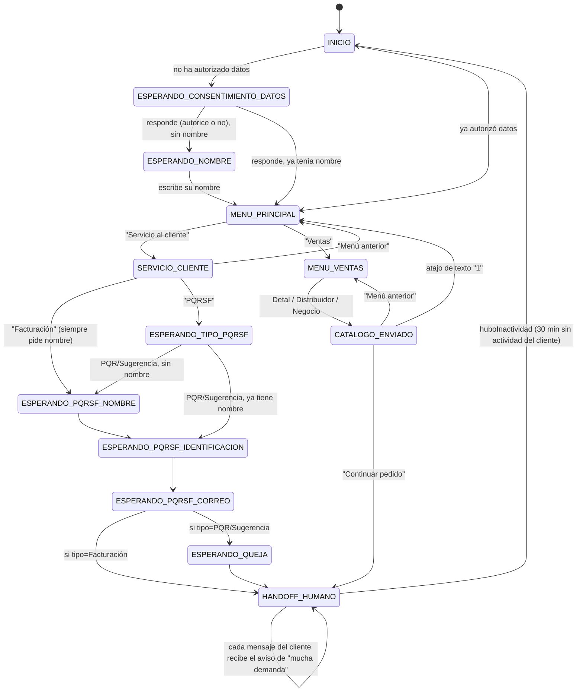

# Flujo de estados del bot

Motor de estados determinista. Sin IA. Es una función pura:

```
procesarTransicion(entrada: EntradaMotor) → ResultadoTransicion
```

`EntradaMotor` trae `estadoActual`, `mensajeTexto`, `contexto`, `clienteYaTieneNombre`,
`nombreCliente`, `huboInactividad` y `aceptoTratamientoDatos`.
`ResultadoTransicion` trae `nuevoEstado`, `respuestas` (plural — un turno puede generar más de un
mensaje), `contextoParcheado` y `registro` (qué debe persistir el caso de uso al llegar a handoff:
un pedido, un registro de servicio al cliente, o nada). **La firma completa y autoritativa vive en
`docs/CONTRATOS.md`** — este documento describe el comportamiento de cada transición, no repite la
firma en detalle.

## Regla de reinicio por inactividad

Antes de invocar el motor, el caso de uso (`application/procesarMensajeEntrante.ts`) calcula
`huboInactividad = (ahora - conversacion.actualizada_en) > ventana`, donde la ventana es
configurable vía `VENTANA_INACTIVIDAD_HORAS` (env, default `0.5` = 30 minutos — ver
`docs/VARIABLES_ENTORNO.md`). Este mismo número también es el umbral base del aviso de "mucha
demanda" (ver más abajo) — decisión del cliente: un solo número para ambos conceptos.

- Si `huboInactividad === true` y `estadoActual !== 'INICIO'` → el motor ignora el estado guardado
  y trata el mensaje como si viniera de `INICIO` (`desdeInicio`, saludo genérico o personalizado
  según si el cliente ya tiene nombre **y** ya autorizó el tratamiento de datos).
- Esto reemplaza cualquier mecanismo de cron para el reinicio del flujo: se resuelve de forma
  perezosa en cada mensaje entrante, así que sobrevive reinicios del servidor sin estado adicional.
- El motor en sí no consulta la hora ni la BD — recibe `huboInactividad` ya calculado como
  parámetro (se mantiene puro).
- 30 minutos es corto frente a la ventana real de mensajería libre de WhatsApp (24h) — es una
  decisión de producto del cliente, no una limitación técnica. Cualquiera de las dos variables se
  puede ajustar libremente en `.env`.

## Diagrama de estados



`HANDOFF_HUMANO` es terminal en el sentido de que el flujo normal no sigue avanzando — pero no es
silencio total: cada mensaje del cliente recibe de vuelta el aviso de "mucha demanda" (ver más
abajo), hasta que pasa la ventana de inactividad y el flujo se reinicia.

## Tabla de transiciones

| Estado origen | Condición del input | Estado destino | Respuesta del bot | Efecto en contexto/BD |
|---|---|---|---|---|
| `INICIO` | mensaje no-texto | `INICIO` (mismo) | "Por ahora solo puedo leer mensajes de texto..." | — |
| `INICIO` | cliente nuevo (sin consentimiento) | `ESPERANDO_CONSENTIMIENTO_DATOS` | Saludo genérico + mensaje de consentimiento (Ley 1581 de 2012), botones "Autorizo" / "No autorizo" | — |
| `INICIO` | cliente ya autorizó y ya tiene nombre | `MENU_PRINCIPAL` | Saludo personalizado "¡Hola de nuevo, {nombre}!..." + botones "Servicio al cliente" / "Ventas" | — |
| `ESPERANDO_CONSENTIMIENTO_DATOS` | opción no reconocida | mismo estado | "No entendí esa opción..." + reenvía botones | — |
| `ESPERANDO_CONSENTIMIENTO_DATOS` | "Autorizo" o "No autorizo", cliente sin nombre | `ESPERANDO_NOMBRE` | "Para darte una atención más personalizada, ¿cuál es tu nombre?" | `contexto.aceptoTratamientoDatos` = true/false; se persiste en `clientes.acepto_tratamiento_datos` |
| `ESPERANDO_CONSENTIMIENTO_DATOS` | ídem, cliente ya tenía nombre | `MENU_PRINCIPAL` | "¿{nombre}, en qué te podemos ayudar?" + botones | ídem |
| `ESPERANDO_NOMBRE` | texto libre (se usa tal cual) | `MENU_PRINCIPAL` | "¿{nombre}, en qué te podemos ayudar?" + botones | Guardar `nombre` en `clientes` |
| `MENU_PRINCIPAL` | opción no reconocida | mismo estado | "No entendí esa opción..." + reenvía botones | — |
| `MENU_PRINCIPAL` | "Servicio al cliente" | `SERVICIO_CLIENTE` | "¿En qué te podemos ayudar?" + botones "Facturación" / "PQRSF" / "Menú anterior" | — |
| `MENU_PRINCIPAL` | "Ventas" | `MENU_VENTAS` | "¿Buscas comprar al detal, eres distribuidor o tienes un negocio?" + botones "Detal" / "Distribuidor" / "Negocio" | — |
| `SERVICIO_CLIENTE` | opción no reconocida | mismo estado | "No entendí esa opción..." + reenvía botones | — |
| `SERVICIO_CLIENTE` | "Menú anterior" | `MENU_PRINCIPAL` | "¡Claro(, {nombre})! ¿En qué más te podemos ayudar?" + botones | — |
| `SERVICIO_CLIENTE` | "Facturación" | `ESPERANDO_PQRSF_NOMBRE` | "Para el área de facturación necesitamos confirmar nuevamente algunos datos, ¿cuál es tu nombre completo?" — **siempre**, aunque el cliente ya tenga nombre guardado | `contexto.pqrsfTipo = 'Facturacion'` |
| `SERVICIO_CLIENTE` | "PQRSF" | `ESPERANDO_TIPO_PQRSF` | "Con gusto te ayudamos con tu PQRSF..." + botones "PQR" / "Sugerencia" | — |
| `ESPERANDO_TIPO_PQRSF` | opción no reconocida | mismo estado | "No entendí esa opción..." + reenvía botones | — |
| `ESPERANDO_TIPO_PQRSF` | PQR/Sugerencia, cliente sin nombre | `ESPERANDO_PQRSF_NOMBRE` | "¿Cuál es tu nombre completo?" | `contexto.pqrsfTipo` |
| `ESPERANDO_TIPO_PQRSF` | ídem, cliente ya tiene nombre | `ESPERANDO_PQRSF_IDENTIFICACION` | "Gracias, {nombre}. ¿Me compartes tu número de identificación (cédula o NIT)?" | `contexto.pqrsfTipo` |
| `ESPERANDO_PQRSF_NOMBRE` | texto libre | `ESPERANDO_PQRSF_IDENTIFICACION` | "Gracias, {nombre}. ¿Me compartes tu número de identificación (cédula o NIT)?" | Guardar `nombre` en `clientes` (solo si aún no lo tenía) |
| `ESPERANDO_PQRSF_IDENTIFICACION` | texto libre | `ESPERANDO_PQRSF_CORREO` | "Perfecto. ¿A qué correo electrónico podemos escribirte para dar respuesta?" | Guardar `identificacion` en `clientes` |
| `ESPERANDO_PQRSF_CORREO` | texto libre, tipo=Facturación | `HANDOFF_HUMANO` | Cierre de facturación + tarjeta resumen (nombre, identificación, correo) | Guardar `correo` en `clientes`; crear registro en `servicio_cliente` (`tipo='Facturacion'`, descripción fija "Solicitud de facturación") |
| `ESPERANDO_PQRSF_CORREO` | texto libre, tipo=PQR/Sugerencia | `ESPERANDO_QUEJA` | "Ya casi terminamos... Cuéntanos con detalle qué sucedió" | Guardar `correo` en `clientes` |
| `ESPERANDO_QUEJA` | texto libre (descripción, se guarda tal cual) | `HANDOFF_HUMANO` | Cierre + tarjeta resumen (tipo, nombre, identificación, correo, descripción) | Crear registro en `servicio_cliente` (`tipo='PQR'|'Sugerencia'`, `descripcion`) |
| `MENU_VENTAS` | opción no reconocida | mismo estado | "No entendí esa opción..." + reenvía botones | — |
| `MENU_VENTAS` | "Detal" / "Distribuidor" / "Negocio" (mismo comportamiento en los 3 casos) | `CATALOGO_ENVIADO` | "Aquí tienes nuestro catálogo:" + documento (catálogo único) + "¿Seguimos con tu pedido?..." con botones "Continuar pedido" / "Menú anterior" | `contexto.canal = 'detal'|'distribucion'|'negocio'` |
| `CATALOGO_ENVIADO` | atajo de texto "1" | `MENU_PRINCIPAL` | "¡Claro(, {nombre})! ¿En qué más te podemos ayudar?" + botones | — |
| `CATALOGO_ENVIADO` | opción no reconocida | mismo estado | "No entendí esa opción..." + reenvía botones | — |
| `CATALOGO_ENVIADO` | "Menú anterior" | `MENU_VENTAS` | "¿Buscas comprar al detal, eres distribuidor o tienes un negocio?" | — |
| `CATALOGO_ENVIADO` | "Continuar pedido" | `HANDOFF_HUMANO` | Cierre + tarjeta resumen (cliente, canal) | Crear registro en `pedidos` (`canal`; `producto_interes` queda vacío — el asesor lo pregunta directamente) |
| `HANDOFF_HUMANO` | cualquier mensaje del cliente | `HANDOFF_HUMANO` | Aviso de "mucha demanda" (ver abajo) | — |
| cualquier estado | `huboInactividad === true` y `estadoActual !== INICIO` | según `INICIO` | Igual que el flujo `INICIO` | Se trata como reinicio de conversación |

## Ya no se pregunta ciudad ni producto de interés

Decisión del cliente: el asesor humano pregunta ciudad y producto directamente al tomar la
conversación, no el bot. Esto simplificó el flujo de Ventas de forma importante frente a versiones
anteriores del proyecto:

- No existe `ESPERANDO_CIUDAD` ni el enum `Ciudad` (`src/dominio/ciudad.ts` se eliminó).
- No existe distinción de catálogo por cobertura ni por canal — un solo PDF (`CATALOGO_URL`) para
  las 3 categorías de Ventas.
- `pedidos.producto_interes` queda siempre vacío (columna conservada solo por compatibilidad con
  registros anteriores a este cambio).
- `clientes.ciudad` y `pedidos.ciudad` siguen existiendo en el schema mismo motivo (compatibilidad
  con datos anteriores), pero ningún flujo nuevo los llena.

## El nombre se pide una sola vez, justo después del consentimiento de datos

A diferencia de versiones anteriores (donde el nombre se pedía solo si el cliente elegía "Ventas",
con un paso extra ofreciendo confirmar el nombre de perfil de WhatsApp), ahora:

- El nombre se pregunta **una sola vez**, inmediatamente después de que el cliente responde el
  consentimiento de datos (autorice o no) — antes de llegar a `MENU_PRINCIPAL`. Ya no se sugiere el
  nombre de perfil de WhatsApp (`customerProfile.name`) — se pregunta directo, sin ese paso
  intermedio (el estado `CONFIRMAR_NOMBRE_PERFIL` ya no existe).
- Por eso `MENU_PRINCIPAL → "Ventas"` va **directo** a `MENU_VENTAS`: para cuando el cliente llega
  ahí, siempre hay un nombre disponible.
- **Excepción**: la rama Facturación de Servicio al cliente vuelve a preguntar el nombre completo
  como confirmación de datos para el proceso de facturación, aunque el cliente ya tenga uno
  guardado (`iniciarCapturaPqrsf.ts`, parámetro `forzarPreguntaNombre`). PQR/Sugerencia no lo hace
  — si el cliente ya tiene nombre, lo salta.

## Menús: Reply Buttons (decidido — no texto libre, no hay List Message activo)

Para evitar datos sucios en las preguntas de respuesta cerrada, se usan Reply Buttons de WhatsApp
en vez de texto libre:

- **Reply Buttons** (`RespuestaBot` tipo `'botones'`): todos los menús del flujo actual
  (`MENU_PRINCIPAL`, `SERVICIO_CLIENTE`, `ESPERANDO_TIPO_PQRSF`, `MENU_VENTAS`,
  `CATALOGO_ENVIADO`) — todos con **2-3 opciones**, dentro del límite de WhatsApp (máx. 3 botones,
  título de cada uno máx. 20 caracteres).
- **List Message** (`RespuestaBot` tipo `'lista'`): el tipo sigue existiendo en el contrato
  (`src/motor/motorEstados.ts`) por si algún menú futuro necesita más de 3 opciones, pero **hoy no
  lo usa ningún estado activo** (la pregunta de ciudad, que era la única que lo necesitaba, se
  eliminó).

El cliente **siempre puede escribir en vez de tocar el botón** — `buscarOpcionSeleccionada()`
(`src/motor/transiciones/seleccionDeLista.ts`) compara por `id` o `título` sin distinguir
mayúsculas/espacios; si no coincide con ninguna opción, el bot repite el mismo menú con un mensaje
corto de "no entendí" en vez de perderse.

## Mensajes inesperados (audio, imagen, sticker, video)

En cualquier estado que no sea `HANDOFF_HUMANO`: si el mensaje entrante no es texto, la transición
correspondiente devuelve el **mismo estado** (`nuevoEstado === estadoActual`) con una respuesta
genérica pidiendo texto. No se pierde el progreso de la conversación.

En `HANDOFF_HUMANO`: se ignora igual que cualquier otro mensaje (no cambia si además dispara el
aviso de demanda — ver abajo, esa lógica no depende de si el mensaje es texto).

## Tarjetas resumen en el handoff

Cada rama que llega a `HANDOFF_HUMANO` manda, además del mensaje de cierre, una tarjeta con los
datos que ya capturó el bot — para que el asesor no tenga que subir en el chat a buscarlos:

- **Pedido** (Ventas): `📦 Resumen del pedido` — Cliente, Canal.
- **PQR/Sugerencia**: `📋 Resumen de tu solicitud` — Tipo, Nombre, Identificación, Correo,
  Descripción.
- **Facturación**: `📃 Resumen de facturación` — Nombre completo, Identificación (Cédula/NIT),
  Correo.

Esto reemplaza al antiguo mensaje `"🔔 NUEVO CLIENTE — ..."` / `"🔔 QUEJA/RECLAMO — ..."` de
versiones anteriores del proyecto — la notificación destacada se descartó a favor de esta tarjeta
más completa, en el mismo hilo del cliente (no hay número o chat separado para el equipo — ver
`clientes.telefono`/`YCLOUD_NUMERO_EQUIPO` en `docs/VARIABLES_ENTORNO.md`, que hoy no se usa en
ninguna notificación).

## Aviso de "mucha demanda" en HANDOFF_HUMANO

El bot **no puede saber si el asesor humano ya respondió** — la coexistencia de YCloud no expone
al webhook los mensajes que el equipo manda desde la app normal de WhatsApp. Ante esa limitación,
la regla se simplificó al máximo (`desdeHandoff.ts`): **cada mensaje que el cliente escribe
mientras la conversación sigue en `HANDOFF_HUMANO` recibe el mismo aviso de vuelta**, sin
condiciones ni temporizadores adicionales. No hay tarea de fondo ni columna de BD dedicada — el
comportamiento sale por completo de la regla de reinicio por inactividad que ya existía:

- Mientras no haya pasado `VENTANA_INACTIVIDAD_HORAS` (30 min por defecto) desde el último mensaje
  del cliente, cualquier mensaje suyo cae en `desdeHandoff.ts`, que siempre responde con el aviso.
- Pasada esa ventana, el siguiente mensaje del cliente ya no pasa por `desdeHandoff.ts` — el motor
  lo trata como si viniera de `INICIO` (ver "Regla de reinicio por inactividad" más arriba) y el
  flujo arranca de nuevo con el saludo, sin aviso de demanda.

Texto del aviso (`src/motor/transiciones/mensajeAvisoDemanda.ts`):

```
Gracias por tu paciencia 🙏 En este momento tenemos mucha demanda, en breve te atiende alguien
de nuestro equipo.
```

Este diseño reemplaza una versión anterior más compleja (tarea programada con `setInterval`,
columna `ultimo_aviso_demanda_en`, cooldown por intervalo) que dependía de que la migración de esa
columna se hubiera aplicado en Supabase y de que el proceso llevara corriendo el tiempo suficiente
para que el `setInterval` disparara — en la práctica resultó frágil y difícil de verificar. La
versión actual no depende de ninguna columna extra ni de temporizadores en segundo plano: se
resuelve por completo con `conversaciones.estado_actual`/`actualizada_en`, que ya existían.

## Condición de "conversación activa" (simplificada)

Una sola fila en `conversaciones` por `cliente_id`, reutilizada indefinidamente (upsert, no buscar
"la activa entre varias"). El reinicio por inactividad resetea `estado_actual` sobre esa misma fila
en vez de crear una nueva.
